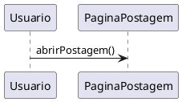

# 1.3. Iniciativas Extras (Modelagem)

## Descrição

Esta página registra as iniciativas realizadas pela equipe que vão além dos artefatos mínimos exigidos pela Entrega 02, apresentando os comprobatórios que evidenciam cada realização.

## Iniciativas

### 1. Suporte a diagramas PlantUML na documentação

**Responsável:** [Caio Alexandre](https://github.com/bitterteriyaki) · **SubEquipe_03** · 17/09/2026

Foi adicionado ao site de documentação o plugin [docsify-plantuml](https://www.npmjs.com/package/docsify-plantuml), que passa a renderizar blocos de código marcados como `plantuml` diretamente como diagramas UML.

A motivação é metodológica. Até então, todos os diagramas do projeto eram imagens binárias (`.png`) exportadas de ferramentas externas, o que traz três limitações para uma entrega avaliada por rastreabilidade:

1. **O histórico do Git não registra a evolução do artefato.** O `diff` de um arquivo binário informa apenas que a imagem mudou, não *o que* mudou nela;
2. **A autoria de uma alteração pontual não fica evidente.** Corrigir a multiplicidade de um relacionamento exige reexportar a imagem inteira, e a contribuição se torna indistinguível de uma substituição completa do diagrama;
3. **O arquivo-fonte precisa ser versionado separadamente** do artefato publicado, criando o risco de divergência entre os dois.

Com o PlantUML, o código-fonte do diagrama passa a ser o próprio documento versionado: cada alteração aparece linha a linha no histórico, com autor e data, e deixa de existir a distinção entre artefato e arquivo-fonte.

**Uso:**

````markdown

````

**Observação:** a renderização ocorre no site publicado (GitPages) e no servidor local. A visualização de arquivos `.md` pela interface do GitHub não executa o plugin e exibirá apenas o bloco de código — as apresentações devem ser feitas pelo GitPages.

**Comprobatórios:** configuração em `docs/index.html`; diagramas que já utilizam o recurso em [Modelagem Estática](https://unbarqdsw2026-2-turma01.github.io/RepositorioTemplateEntrega2-TabNews-Forum/#/Base/Relatórios/SubEquipe_03/ModelagemEstatica) e [Modelagem Dinâmica](https://unbarqdsw2026-2-turma01.github.io/RepositorioTemplateEntrega2-TabNews-Forum/#/Base/Relatórios/SubEquipe_03/ModelagemDinamica).

### 2. Padronização do ambiente de desenvolvimento local

**Responsável:** [Caio Alexandre](https://github.com/bitterteriyaki) · **SubEquipe_03** · 17/09/2026

Foi adicionado um arquivo `mise.toml` na raiz do repositório, fixando as versões das ferramentas necessárias para executar o site de documentação localmente e padronizando o comando de execução entre os integrantes.

```bash
mise install     # provisiona Node.js e pnpm nas versões fixadas
mise run dev     # inicia o site em http://localhost:3000
```

A configuração não introduz `package.json`, arquivo de lock ou diretório de dependências no repositório: o `docsify-cli` é obtido e executado sob demanda via `pnpm dlx`, preservando o repositório como um projeto exclusivamente de documentação.

**Comprobatórios:** arquivo `mise.toml` na raiz do repositório.

### Guia Geral para Diagrama de Estados

**Responsável:** [Giovana Fontes](https://github.com/GiovanaFontesS) · **SubEquipe_01** · 17/09/2026

Foi elaborado um guia geral para a construção de Diagramas de Estados, com o objetivo de auxiliar os integrantes da equipe na criação e revisão desses diagramas ao longo do projeto.

A iniciativa busca contribuir para a padronização da documentação, apresentando orientações sobre a identificação dos estados, definição das transições, representação dos estados inicial e final e organização visual dos diagramas.

O guia também conta com um checklist para auxiliar na revisão dos diagramas antes de sua inclusão na documentação, verificando se os principais elementos foram representados e se o fluxo está coerente com o comportamento do sistema.

A proposta é servir como uma referência rápida para a equipe, facilitando a elaboração dos diagramas e mantendo uma maior consistência entre os diferentes artefatos produzidos no projeto.


**1. Identifique o elemento que terá seus estados representados**

Primeiramente, defina qual objeto, entidade ou componente do sistema será representado pelo diagrama. O diagrama deve acompanhar o comportamento desse elemento ao longo do seu ciclo de vida.

**2. Identifique os principais estados**

Liste as situações relevantes pelas quais o elemento pode passar. Os estados devem representar condições ou situações em que o elemento permanece por determinado período, como, por exemplo:

- Criado
- Ativo
- Em análise
- Aprovado
- Recusado
- Finalizado

**3. Defina o estado inicial e o final**

Todo diagrama deve indicar claramente onde o fluxo começa e, quando aplicável, onde termina.

- **Estado inicial:** representa o início do ciclo de vida.
- **Estado final:** representa o encerramento do ciclo de vida.

**4. Identifique os eventos que causam mudanças**

Entre cada estado, deve existir um evento ou condição que provoque a mudança de estado. Essas transições devem ser nomeadas de forma clara e representar uma ação ou acontecimento do sistema. 


## Referências

<p>
  UNB FCTE — ARQDSW. Módulo de Modelagem. Disponível em: 
  <a href="https://sites.google.com/view/unb-fcte-arqdsw/m%C3%B3dulos/m%C3%B3dulo-modelagem?authuser=0" target="_blank" rel="noopener noreferrer">
    https://sites.google.com/view/unb-fcte-arqdsw/módulos/módulo-modelagem
  </a>. 
  <small>Acesso em: 16 set. 2026.</small>
</p>


## Histórico de Versões

| Versão | Data | Descrição | Autor(es) | Revisor(es) | Detalhe da Revisão |
|:------:|:----:|:----------|:----------|:------------|:-------------------|
| 1.0 | 13/09/2026 | Criação do documento de Iniciativas Extras da entrega de Modelagem. | [Arthur Fernandes](https://github.com/arthurfernandesj) |  [Guilherme Moura](https://github.com/Guilherme-Moura)| Criação da estrutura inicial da página. |
| 1.1 | 17/09/2026 | Registro das iniciativas de suporte a PlantUML e de padronização do ambiente local. | [Caio Alexandre](https://github.com/bitterteriyaki) | [Arthur Fernandes](https://github.com/arthurfernandesj) | Inclusão da configuração do plugin docsify-plantuml, com a justificativa metodológica de rastreabilidade, e da configuração do mise para execução local do site. |
| 1.2 | 17/09/2026 | Registro das iniciativas de suporte a PlantUML e de padronização do ambiente local. | [Giovana Fontes](https://github.com/GiovanaFontesS) | [Arthur Fernandes](https://github.com/arthurfernandesj) | Inclusão de um guia para diagrama de estados para os integrantes do grupo. |
| 1.2 | 17/09/2026 | Correção dos links de comprobatório. | [Caio Alexandre](https://github.com/bitterteriyaki) | [Leonardo Fachinello Bonetti](https://github.com/LeoFacB) | Substituição dos caminhos relativos por URLs absolutas do GitPages, de modo que os comprobatórios funcionem tanto na página publicada quanto na visualização dos arquivos pelo GitHub. |

<p align="center">Tabela 1: Histórico de Versões.</p>
