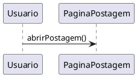

# 1.3. Iniciativas Extras (Modelagem)

## Descrição

Esta página registra as iniciativas realizadas pela equipe que vão além dos artefatos mínimos exigidos pela Entrega 02, apresentando os comprobatórios que evidenciam cada realização.

## Iniciativas

### 1. Suporte a diagramas PlantUML na documentação

**Responsável:** [Caio Alexandre](https://github.com/bitterteriyaki) · **SubEquipe_03** · 17/09/2026

Foi adicionado ao site de documentação o plugin [docsify-plantuml](https://www.npmjs.com/package/docsify-plantuml), que passa a renderizar blocos de código marcados como `plantuml` diretamente como diagramas UML.

A motivação é metodológica. Até então, todos os diagramas do projeto eram imagens binárias (`.png`) exportadas de ferramentas externas, o que traz três limitações para uma entrega avaliada por rastreabilidade:

1. **O histórico do Git não registra a evolução do artefato.** O `diff` de um arquivo binário informa apenas que a imagem mudou, não *o que* mudou nela;
2. **A autoria de uma alteração pontual não fica evidente.** Corrigir a multiplicidade de um relacionamento exige reexportar a imagem inteira, e a contribuição se torna indistinguível de uma substituição completa do diagrama;
3. **O arquivo-fonte precisa ser versionado separadamente** do artefato publicado, criando o risco de divergência entre os dois.

Com o PlantUML, o código-fonte do diagrama passa a ser o próprio documento versionado: cada alteração aparece linha a linha no histórico, com autor e data, e deixa de existir a distinção entre artefato e arquivo-fonte.

**Uso:**

````markdown

````

**Observação:** a renderização ocorre no site publicado (GitPages) e no servidor local. A visualização de arquivos `.md` pela interface do GitHub não executa o plugin e exibirá apenas o bloco de código — as apresentações devem ser feitas pelo GitPages.

**Comprobatórios:** configuração em `docs/index.html`; diagramas que já utilizam o recurso em [Modelagem Estática](Base/Relatórios/SubEquipe_03/ModelagemEstatica.md) e [Modelagem Dinâmica](Base/Relatórios/SubEquipe_03/ModelagemDinamica.md).

### 2. Padronização do ambiente de desenvolvimento local

**Responsável:** [Caio Alexandre](https://github.com/bitterteriyaki) · **SubEquipe_03** · 17/09/2026

Foi adicionado um arquivo `mise.toml` na raiz do repositório, fixando as versões das ferramentas necessárias para executar o site de documentação localmente e padronizando o comando de execução entre os integrantes.

```bash
mise install     # provisiona Node.js e pnpm nas versões fixadas
mise run dev     # inicia o site em http://localhost:3000
```

A configuração não introduz `package.json`, arquivo de lock ou diretório de dependências no repositório: o `docsify-cli` é obtido e executado sob demanda via `pnpm dlx`, preservando o repositório como um projeto exclusivamente de documentação.

**Comprobatórios:** arquivo `mise.toml` na raiz do repositório.

## Histórico de Versões

| Versão | Data | Descrição | Autor(es) | Revisor(es) | Detalhe da Revisão |
|:------:|:----:|:----------|:----------|:------------|:-------------------|
| 1.0 | 13/09/2026 | Criação do documento de Iniciativas Extras da entrega de Modelagem. | [Arthur Fernandes](https://github.com/arthurfernandesj) |  | Criação da estrutura inicial da página. |
| 1.1 | 17/09/2026 | Registro das iniciativas de suporte a PlantUML e de padronização do ambiente local. | [Caio Alexandre](https://github.com/bitterteriyaki) | [Arthur Fernandes](https://github.com/arthurfernandesj) | Inclusão da configuração do plugin docsify-plantuml, com a justificativa metodológica de rastreabilidade, e da configuração do mise para execução local do site. |

<p align="center">Tabela 1: Histórico de Versões.</p>
