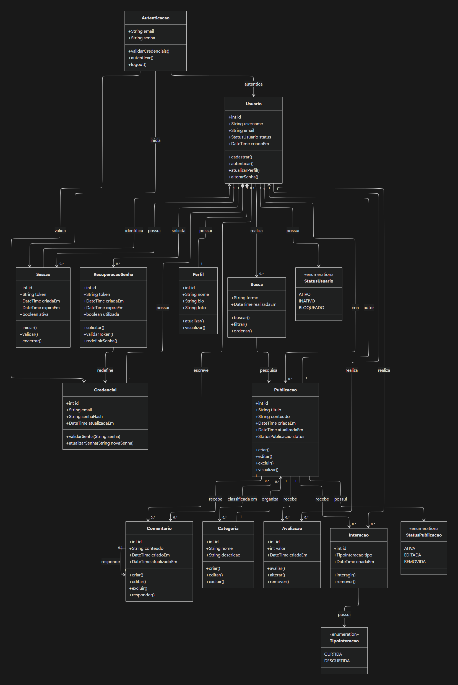

# SubEquipe_01 — Modelagem Estática na Notação UML

## Descrição

Modelagem estática da SubEquipe_01, no escopo do **FOCO_01 — Modelagem Estática na Notação UML**. O documento apresenta a modelagem estrutural do sistema Fórum, utilizando a notação UML para representar suas principais classes, atributos, métodos e relacionamentos.

A modelagem tem como objetivo representar a estrutura do software de forma clara, permitindo visualizar os principais elementos que compõem o sistema e suas relações.

## Objetivo

Elaborar uma modelagem estática em UML para o sistema Fórum, evidenciando suas principais classes, responsabilidades, atributos, métodos e relacionamentos, de forma a facilitar a compreensão da estrutura do software e apoiar sua implementação, manutenção e evolução.

## Metodologia

A modelagem estática foi elaborada a partir da análise do escopo do produto, das funcionalidades previstas para o sistema e dos artefatos desenvolvidos anteriormente pela equipe.

O processo envolveu a identificação das principais entidades e responsabilidades do sistema, buscando determinar quais elementos deveriam ser representados como classes, seus respectivos atributos e métodos, além dos relacionamentos existentes entre elas.

Para a elaboração do modelo, foram consideradas as principais funcionalidades do Fórum, incluindo cadastro e autenticação de usuários, criação e visualização de publicações, respostas, organização por categorias, avaliações, interações e busca de discussões.

A modelagem foi desenvolvida de forma colaborativa pelos integrantes da SubEquipe_01, utilizando a notação UML para representar os elementos estruturais identificados.

As decisões de modelagem buscaram manter um nível de abstração adequado ao objetivo da entrega, priorizando os elementos diretamente relacionados ao funcionamento do sistema e evitando detalhamentos de implementação que não fossem necessários para a representação estática.

## Escolha da Modelagem

Para o **FOCO_01 — Modelagem Estática na Notação UML**, a SubEquipe_01 adotou o **Diagrama de Classes** como modelo principal.

A escolha foi realizada por esse modelo permitir representar de forma direta a estrutura do sistema, evidenciando as classes, seus atributos, métodos e os relacionamentos existentes entre os elementos.

O Diagrama de Classes também permite estabelecer uma visão estrutural do domínio do Fórum, relacionando funcionalidades previstas no escopo do produto aos elementos que compõem a solução.

Além do modelo geral do sistema, foi elaborado um recorte específico relacionado ao **Login e Autenticação**, permitindo detalhar a contribuição realizada pela SubEquipe_01 nessa parte da modelagem.

## Modelagem Estática

### Diagrama de Classes

O Diagrama de Classes apresenta uma visão geral da estrutura do sistema Fórum, representando os principais elementos necessários para o funcionamento das funcionalidades previstas no escopo do produto.

Entre os elementos representados estão as classes relacionadas aos usuários, autenticação, sessões, publicações, comentários, categorias, avaliações, interações e busca.

A organização das classes busca demonstrar as responsabilidades de cada elemento e os relacionamentos existentes entre eles, proporcionando uma visão estrutural do sistema.

## Diagrama de Pacotes 

### Diagrama de Pacotes

O diagrama de pacotes do módulo de **Login e Cadastro** do Fórum TabNews, desenvolvido pelo **Grupo 2**, representa a organização dos principais componentes planejados para essa parte do sistema e as dependências existentes entre eles.

A estrutura foi organizada com base no princípio de **arquitetura em camadas**, buscando separar as responsabilidades de cada parte do sistema. A camada de **apresentação** reúne os elementos relacionados às telas de Login e Cadastro e à interação com o usuário. A camada de **aplicação** concentra as funcionalidades e regras necessárias para realizar o login, o cadastro e as validações dos usuários. Já a camada de **dados** é responsável pelo gerenciamento das informações dos usuários e pela comunicação com os mecanismos de armazenamento e autenticação.

A separação dessas responsabilidades permite organizar melhor o código e facilita a manutenção e evolução da funcionalidade. As dependências entre os pacotes seguem o fluxo da aplicação, partindo da camada de apresentação para a camada de aplicação e, posteriormente, para a camada de dados.

### Recorte — Login e Autenticação

Como detalhamento da modelagem, foi elaborado um recorte do Diagrama de Classes relacionado ao processo de **Login e Autenticação**.

O recorte representa as principais classes envolvidas nesse processo: `Usuario`, `Credencial`, `Autenticacao` e `Sessao`.

A classe `Usuario` representa o usuário do sistema e mantém sua relação com as credenciais utilizadas no processo de autenticação. A classe `Credencial` concentra as informações necessárias para validação das credenciais de acesso.

A classe `Autenticacao` é responsável por representar o processo de validação e autenticação do usuário, enquanto a classe `Sessao` representa a sessão criada após a autenticação, incluindo informações relacionadas ao seu controle e validade.

Figura 2: Recorte do Diagrama de Classes — Login e Autenticação. Fonte: SubEquipe_01 (2026).

## Senso Crítico e Decisões de Modelagem

Durante a elaboração do modelo, a SubEquipe_01 avaliou quais elementos deveriam ser representados no Diagrama de Classes, considerando o escopo definido para o sistema e o nível de abstração adequado para a entrega.

Foi priorizada a representação das classes e relacionamentos diretamente relacionados às principais funcionalidades do Fórum, evitando a inclusão de elementos excessivamente específicos de implementação.

No recorte de Login e Autenticação, foram destacadas as classes `Usuario`, `Credencial`, `Autenticacao` e `Sessao`, por representarem os principais elementos envolvidos no processo de acesso ao sistema.

A definição dos relacionamentos buscou representar as responsabilidades e dependências entre os elementos de forma coerente com o funcionamento esperado da aplicação.

Dentro do módulo, foi adotada uma organização baseada em **arquitetura em camadas**, na qual a camada de apresentação (`presentation`) utiliza os recursos disponibilizados pela camada de aplicação (`application`), que concentra as operações de realizar login, cadastrar usuário e validar os dados informados. A camada de aplicação, por sua vez, utiliza a camada de dados (`data`), responsável pelo acesso e gerenciamento das informações de usuários e pelos mecanismos relacionados à autenticação. Dessa forma, as dependências seguem o fluxo `presentation → application → data`, mantendo cada camada responsável por uma parte específica do funcionamento do módulo e contribuindo para a organização, manutenção e evolução do sistema.

## Referências

LUCID SOFTWARE INC. **Tutorial de diagrama de classes UML**. Disponível em: [**https://app.lucid.co/pt/diagrama/uml/tutorial-de-diagrama-de-classes**](https://app.lucid.co/pt/diagrama/uml/tutorial-de-diagrama-de-classes). Acesso em: 15 set. 2026.

OBJECT MANAGEMENT GROUP. **OMG Unified Modeling Language (OMG UML), Version 2.5.1**. 2017. Disponível em: [**https://www.omg.org/spec/UML/2.5.1/PDF**](https://www.omg.org/spec/UML/2.5.1/PDF). Acesso em: 15 set. 2026.

UNB FCTE — ARQDSW. **Módulo de Modelagem**. Disponível em: [**https://sites.google.com/view/unb-fcte-arqdsw/módulos/módulo-modelagem?authuser=0**](https://sites.google.com/view/unb-fcte-arqdsw/módulos/módulo-modelagem?authuser=0). Acesso em: 15 set. 2026.

## Nível de Contribuição dos Integrantes

| Nome | % de Contribuição |
|:---|:---:|
| [Arthur Fernandes](https://github.com/arthurfernandesj) | |
| [Giovana Fontes](https://github.com/GiovanaFontesS) | |
| | |

Tabela 1: Contribuição dos integrantes.

---

## Histórico de Versões

| Versão | Data | Descrição | Autor(es) | Revisor(es) | Detalhe da Revisão |
|:------:|:----:|:----------|:----------|:------------|:-------------------|
| 1.0 | 13/09/2026 | Criação do documento de Modelagem Estática na Notação UML da SubEquipe_01. | [Arthur Fernandes](https://github.com/arthurfernandesj) | [Giovana Fontes](https://github.com/GiovanaFontesS) | Criação da estrutura inicial do documento e definição do escopo da modelagem estática. |
| 1.1 | 14/09/2026 | Elaboração da modelagem relacionada ao Login e Autenticação. | [Giovana Fontes](https://github.com/GiovanaFontesS) | [Arthur Fernandes](https://github.com/arthurfernandesj) | Desenvolvimento do recorte do Diagrama de Classes referente ao Login e Autenticação, contemplando as principais classes e seus relacionamentos. |
| 1.2 | 15/09/2026 | Ajustes e atualização do documento de Modelagem Estática. | [Arthur Fernandes](https://github.com/arthurfernandesj) | [Giovana Fontes](https://github.com/GiovanaFontesS) | Ajustes na estrutura e descrição do documento, atualização da modelagem para o Diagrama de Classes, organização do modelo completo e adequação do recorte de Login e Autenticação. |

Tabela 2: Histórico de Versões.

---

Ver também: [Modelagem Dinâmica na Notação UML](ModelagemDinamica.md) · [IA Generativa](IAGenerativa.md)