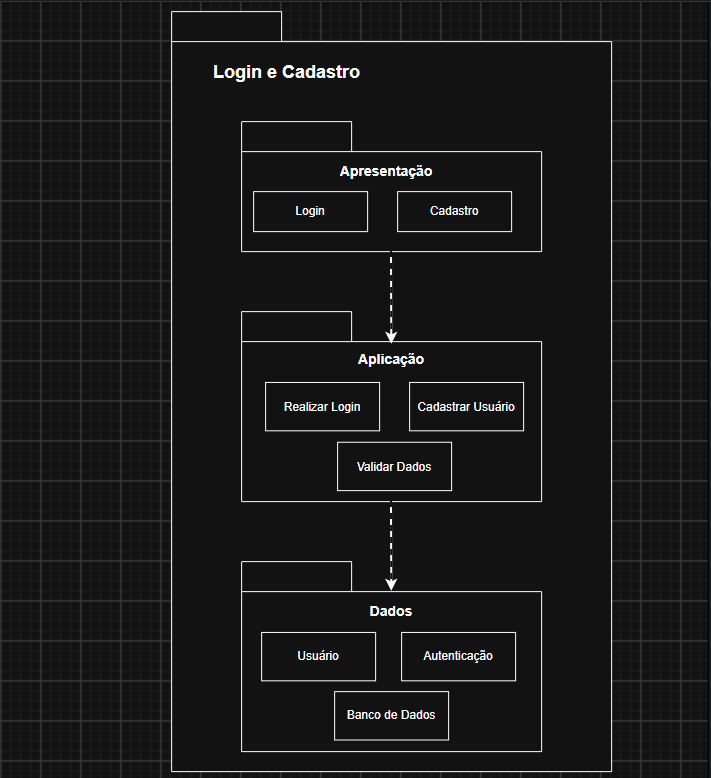

# SubEquipe_01 — Modelagem Estática na Notação UML

## Descrição

Modelagem do processo de negócio da SubEquipe_01, no escopo do **FOCO_01 — Modelagem Estática na Notação UML**. O documento apresenta a modelagem estática do software desenvolvido pela equipe, utilizando a notação UML para representar seus principais elementos estruturais e relacionamentos.

## Objetivo

Elaborar uma modelagem estática em UML para o sistema desenvolvido pela equipe, evidenciando seus principais elementos estruturais, relacionamentos e organização, de forma a facilitar a compreensão da estrutura do software.

## Metodologia

A modelagem estática foi elaborada a partir da análise do sistema e de suas principais funcionalidades, buscando identificar os elementos estruturais necessários para representar a solução.

O processo envolveu a identificação das principais entidades, classes, atributos, métodos e relacionamentos presentes no sistema, seguida da representação desses elementos utilizando a notação UML.

Para a elaboração do modelo, foram analisados os requisitos e as funcionalidades definidas para o projeto, relacionando-os aos elementos estruturais do software. A modelagem foi desenvolvida de forma colaborativa pelos integrantes da SubEquipe_01, utilizando as ferramentas adotadas pela equipe para elaboração e documentação dos modelos.

As decisões de modelagem foram fundamentadas nos conceitos da UML e na literatura de Engenharia de Software, buscando representar de maneira clara e consistente a estrutura do sistema.

## Diagrama de Pacotes 

### Diagrama de Pacotes

O diagrama de pacotes do módulo de **Login e Cadastro** do Fórum TabNews, desenvolvido pelo **Grupo 2**, representa a organização dos principais componentes planejados para essa parte do sistema e as dependências existentes entre eles.

A estrutura foi organizada com base no princípio de **arquitetura em camadas**, buscando separar as responsabilidades de cada parte do sistema. A camada de **apresentação** reúne os elementos relacionados às telas de Login e Cadastro e à interação com o usuário. A camada de **aplicação** concentra as funcionalidades e regras necessárias para realizar o login, o cadastro e as validações dos usuários. Já a camada de **dados** é responsável pelo gerenciamento das informações dos usuários e pela comunicação com os mecanismos de armazenamento e autenticação.

A separação dessas responsabilidades permite organizar melhor o código e facilita a manutenção e evolução da funcionalidade. As dependências entre os pacotes seguem o fluxo da aplicação, partindo da camada de apresentação para a camada de aplicação e, posteriormente, para a camada de dados.

### Modelagem Estática

O diagrama de pacotes representa a organização modular do módulo de **Login e Cadastro do Fórum TabNews**, desenvolvido pelo Grupo 2, com foco nas funcionalidades de autenticação e gerenciamento de usuários. A estrutura do módulo foi organizada em três camadas principais: `presentation`, `application` e `data`, responsáveis, respectivamente, pela interação com o usuário, pela execução das funcionalidades de login e cadastro e pelo gerenciamento dos dados e autenticação.

  

Figura 1: Modelo Estático na notação UML. Fonte: SubEquipe_01 (2026).

Dentro do módulo, foi adotada uma organização baseada em **arquitetura em camadas**, na qual a camada de apresentação (`presentation`) utiliza os recursos disponibilizados pela camada de aplicação (`application`), que concentra as operações de realizar login, cadastrar usuário e validar os dados informados. A camada de aplicação, por sua vez, utiliza a camada de dados (`data`), responsável pelo acesso e gerenciamento das informações de usuários e pelos mecanismos relacionados à autenticação. Dessa forma, as dependências seguem o fluxo `presentation → application → data`, mantendo cada camada responsável por uma parte específica do funcionamento do módulo e contribuindo para a organização, manutenção e evolução do sistema.

## Referências

UNB FCTE — ARQDSW. **Módulo de Modelagem**. Disponível em: [**Módulo de Modelagem**](https://sites.google.com/view/unb-fcte-arqdsw/módulos/módulo-modelagem?authuser=0). Acesso em: 12 set. 2026.

## Nível de Contribuição dos Integrantes

| Nome | % de Contribuição |
|------|-------------------|
|   [Arthur Fernandes](https://github.com/arthurfernandesj)   |                   |
|   [Giovana Fontes](https://github.com/GiovanaFontesS)    |                   |
|      |                   |

Tabela 1: Contribuição dos integrantes.

## Histórico de Versões

| Versão | Data | Descrição | Autor(es) | Revisor(es) | Detalhe da Revisão |
|:------:|:----:|:----------|:----------|:------------|:-------------------|
| 1.0 | 13/09/2026  | Criação do documento de Modelagem Estática na Notação UML da SubEquipe_01. | [Arthur Fernandes](https://github.com/arthurfernandesj) |  | Criação da estrutura inicial do documento e preparação para inserção da modelagem estática. |
[Giovana Fontes](https://github.com/GiovanaFontesS) |  | Inserção de imagem do diagrama Modelagem Estatica |

Tabela 2: Histórico de Versões.

Ver também: [Modelagem Dinâmica na Notação UML](ModelagemDinamica.md) · [IA Generativa](IAGenerativa.md)