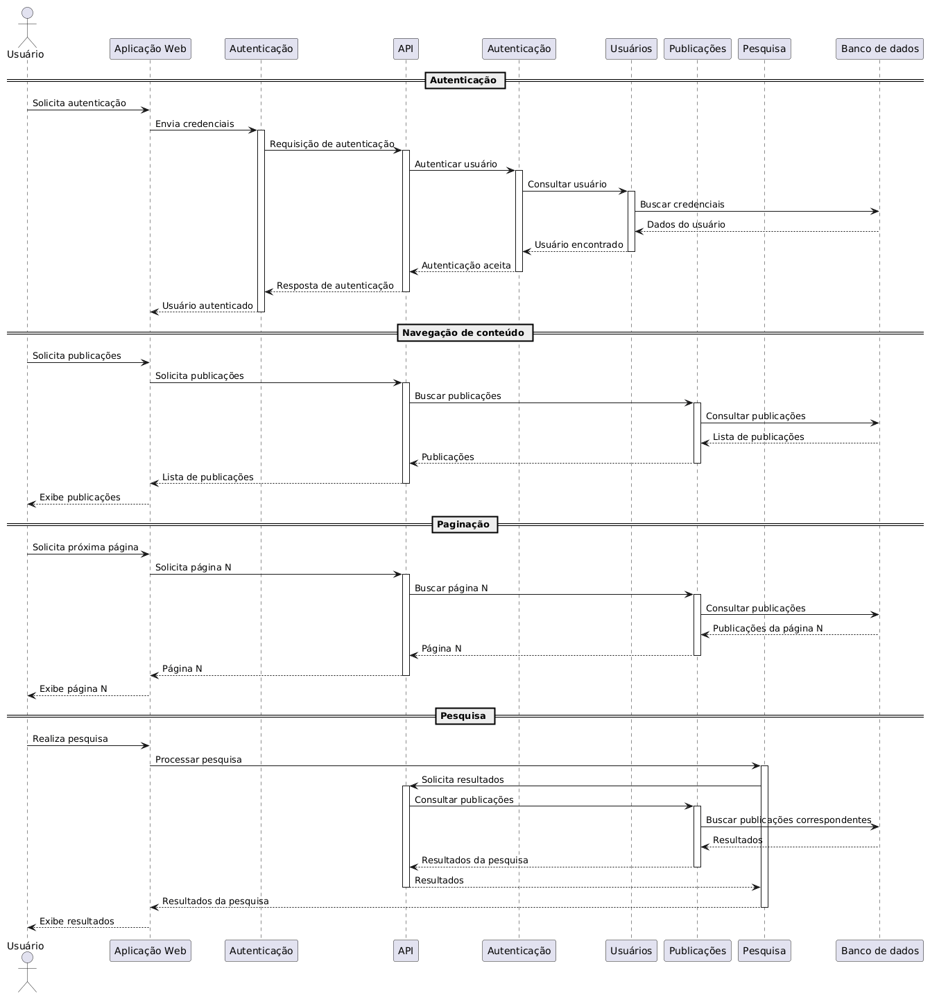
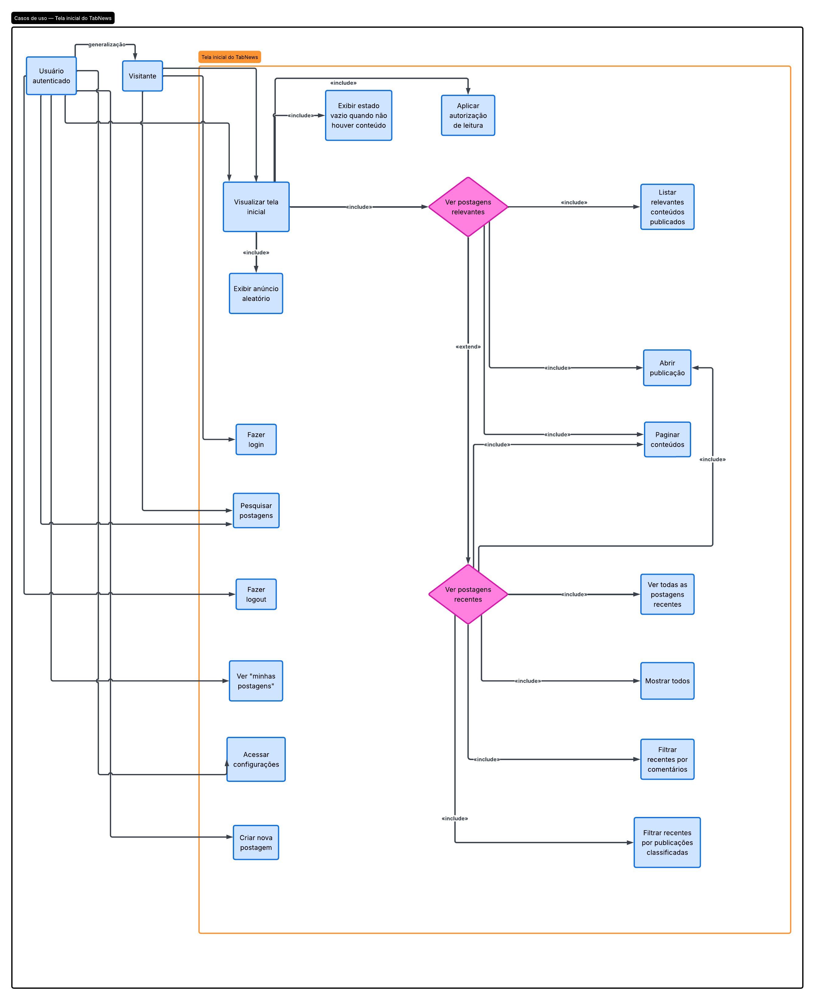
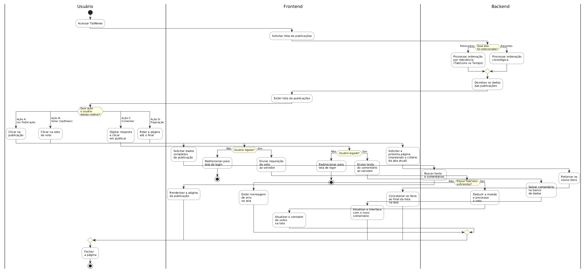

# SubEquipe_02 — Modelagem Dinâmica na Notação UML

## Descrição

Modelagem do processo de negócio da SubEquipe_02, no escopo do **FOCO_02 — Modelagem Dinâmica na Notação UML**. O documento apresenta a modelagem dinâmica do software utilizando a notação UML, buscando representar o comportamento do sistema e a interação entre seus principais elementos ao longo da execução dos processos.

## Objetivo

Elaborar uma modelagem dinâmica em UML para o sistema desenvolvido pela equipe, evidenciando o comportamento dos processos, as atividades realizadas, os eventos, as interações e os pontos de decisão envolvidos na execução das funcionalidades do sistema.

## Metodologia

A modelagem dinâmica foi elaborada a partir da análise dos processos e das funcionalidades do sistema, buscando representar o comportamento da aplicação e a sequência de eventos envolvidos em sua execução.

O processo envolveu a identificação dos principais fluxos e interações do sistema, considerando as ações realizadas pelos usuários e as respostas produzidas pela aplicação. A partir dessa análise, foram definidos os elementos necessários para representar o comportamento do processo utilizando a notação UML.

A elaboração do modelo foi realizada de forma colaborativa pelos integrantes da SubEquipe_02, utilizando as ferramentas adotadas pela equipe para construção e documentação dos diagramas.

As decisões de modelagem foram fundamentadas nos conceitos da UML e na literatura de Engenharia de Software, buscando representar de maneira clara e consistente o comportamento do sistema.

## Conteúdo

### Modelagem Dinâmica

A **modelagem dinâmica** representa o comportamento de um sistema durante sua execução, mostrando como seus componentes, objetos ou usuários **interagem ao longo do tempo**. Diferentemente da modelagem estática, que descreve a estrutura do sistema e seus elementos, a modelagem dinâmica busca representar **fluxos, eventos, mensagens e mudanças de estado**.

### Diagrama de Sequência do TabNews — Isaac Menezes

O modelo foi construído usando o site plantuml.com e sua linguagem descritiva padrão. 
Todos os casos de uso, gates, lifetimes, visões e psicinas foram pensadas a partir dos seguintes objetos presentes no fórum:
- Aba Relevantes;
- Aba Recentes;
- Campo de pesquisa;
- Ícone de mudança de tema de cor;
- Função de login;
- Função de cadastro;
- Aba de publicações;
- Aba de comentários;
- Aba de classificados;
- Aba Todos;
- Lista de comentários;
- Botão para próxima página;
- Botão para página anterior;
- Botão de contato;
- Botão de FAQ;
- Botão com link do GitHub;
- Botões de FAQ, GitHub, Museu, RSS, Sobre, Termos de Uso e curso.dev.

De maneira evidente, esses objetos foram melhor ajustados, levando em consideração seus comportamentos e dependências no site, para gerar o seguinte Diagrama de Sequência.

  
  
  
<strong>Figura 1:</strong> Diagrama Sequencial. Fonte: SubEquipe_02 (2026).

O Diagrama mostra as relações dinâmicas que o usuário tem com diversos componentes do fórum, detre eles, API, publicações, banco de dados, etc. As respectivas piscinas de cada interação também estão representadas.
O Diagrama foi feito na linguagem descritiva padrão do plantuml.com e o link para o script é este: https://drive.google.com/file/d/1Uyj1VkuLbT1S0bWx4iKhvRRACIL9Z8ka/view?usp=sharing

### Diagrama de casos de uso - Pablo Rodrigues
Modelo feito usando Lucidcahrt com o auxílio de sua IA, seguindo a visão dos seguintes atores:
- Visitante anônimo
- Usuário logado

O diagrama é composto apenas pelo caso de uso da tela de postagens relevantes e postagens recentes.
Cobrindo todas as opções do usuário, como pesquisar, paginar, acessar as postagens, entre outros.

  
  
  
<strong>Figura 2:</strong> Diagrama de Casos de Uso. Fonte: SubEquipe_02 (2026).

### Diagrama de atividades - Pedro Ramos

O diagrama de atividades detalha o fluxo de interação do usuário no TabNews, mapeando a comunicação entre interface, frontend e backend. Os processos centrais do diagrama incluem:

* **Navegação inicial:** O fluxo começa com o acesso ao site e a requisição da lista de publicações. Se houver conteúdo, o usuário pode ler, pesquisar ou explorar; caso contrário, a navegação continua normalmente.
* **Interação e validação:** Ao abrir uma postagem, o usuário pode ver ou avaliar o conteúdo. O diagrama destaca a exigência de autenticação e a validação de dados antes de permitir ações interativas, como a criação de comentários.
* **Processamento no backend:** O diagrama mostra o caminho das requisições no servidor, detalhando o acesso aos dados, a verificação de permissões, o tratamento de erros e a confirmação das operações.
* **Comportamento reativo:** Fica claro que o sistema não é linear. As respostas da interface dependem de escolhas do usuário, regras de negócio e validações do servidor para garantir uma experiência consistente no fórum.

  
  
  
<strong>Figura 3:</strong> Diagrama de Atividades. Fonte: SubEquipe_02 (2026).

A partir da análise do diagrama, é possível perceber que o fluxo principal do sistema do TabNews foi modelado de forma clara e organizada, mostrando a relação entre ação do usuário, processamento da interface e resposta do backend. Esse tipo de representação serve para entender a dinâmica da aplicação e para apoiar futuras melhorias no design e na arquitetura do software.

## Ponto de vista do integrantes

### Isaac Menezes

O Diagrama de Sequência permitiu representar a ordem das interações realizadas na tela inicial. O modelo demonstra como o usuário inicia uma ação e como o sistema responde a cada solicitação. Também foram evidenciadas as mensagens trocadas entre os componentes envolvidos no processo. Essa representação facilita a compreensão do fluxo de execução das funcionalidades. Dessa forma, torna-se mais simples identificar o comportamento do sistema em diferentes situações.

### Pablo Rodrigues

A elaboração do Diagrama de Casos de Uso possibilitou compreender melhor as principais funcionalidades disponíveis na tela inicial e a forma como os usuários interagem com o sistema.
A construção do modelo também evidenciou a importância de identificar os atores e suas respectivas ações antes de definir os casos de uso, permitindo representar de maneira clara as operações que podem ser realizadas a partir da tela inicial.

### Pedro Ramos

O Diagrama de Atividades permitiu entender como o usuário interage com o sistema e como cada etapa do fluxo influencia a experiência dentro do TabNews. Além disso, o diagrama mostrou como a interface, o frontend e o backend trabalham de forma integrada para entregar uma experiência consistente. Essa visão ajudou a compreender melhor a lógica do sistema e a relação entre comportamento do usuário e funcionamento da plataforma.

## Referências

H. Washizaki, eds., Guide to the Software Engineering Body of Knowledge (SWEBOK Guide), Version 4.0, IEEE Computer Society, 2024. Acesso em 14 set. de 2026.

LUCID SOFTWARE INC. **Tutorial de diagrama de classes UML**. Disponível em: [https://app.lucid.co/pt/diagrama/uml/tutorial-de-diagrama-de-classes](https://app.lucid.co/pt/diagrama/uml/tutorial-de-diagrama-de-classes). Acesso em: 15 set. 2026.

OBJECT MANAGEMENT GROUP. **OMG Unified Modeling Language (OMG UML), Version 2.5.1**. 2017. Disponível em: [https://www.omg.org/spec/UML/2.5.1/PDF](https://www.omg.org/spec/UML/2.5.1/PDF). Acesso em: 15 set. 2026.

TABNEWS. **TabNews**. Disponível em: [https://www.tabnews.com.br](https://www.tabnews.com.br). Acesso em: 16 set. 2026.

UNB FCTE — ARQDSW. **Módulo de Modelagem**. Disponível em: [https://sites.google.com/view/unb-fcte-arqdsw/módulos/módulo-modelagem?authuser=0](https://sites.google.com/view/unb-fcte-arqdsw/módulos/módulo-modelagem?authuser=0). Acesso em: 15 set. 2026.

## Nível de Contribuição dos Integrantes

| Nome | % de Contribuição |
|------|-------------------|
|Isaac Menezes| 33,3% |
|Pablo Rodrigues|33,3%|
|Pedro Ramos|33,3%|

Tabela 1: Contribuição dos integrantes.

## Histórico de Versões

| Versão | Data | Descrição | Autor(es) | Revisor(es) | Detalhe da Revisão |
|:------:|:----:|:----------|:----------|:------------|:-------------------|
| 1.0 | 13/09/2026 | Criação do documento de Modelagem Dinâmica na Notação UML da SubEquipe_02. | [Arthur Fernandes](https://github.com/arthurfernandesj) | [Pablo Rodrigues](https://github.com/Pablo-R-L) | Criação da estrutura inicial do documento e preparação para inserção da modelagem dinâmica. |
| 1.1 | 16/09/2026 | Teste inicial de permissão de contribuição. |[Isaac Menezes Pereira](https://github.com/pratamz250) | [Pedro Ramos](https://github.com/PedroRSR) | Apenas inserido nome. |
| 1.2 | 17/09/2026 | Inserção de Diagrama de Sequência |[Isaac Menezes Pereira](https://github.com/pratamz250) | [Pablo Rodrigues](https://github.com/Pablo-R-L) | Diagrama de Sequência inserido, construído no plantuml.com com sua linguagem descritiva padrão. |
| 1.3 | 17/09/2026 | Criação do diagrama de casos de uso. | [Pablo Rodrigues](https://github.com/Pablo-R-L)  | [Pedro Ramos](https://github.com/PedroRSR) | Criação do diagrama de casos de usos usando a ferramenta lucidchart e adição, junto à descrição do diagrama, no documento. |
| 1.4 | 17/09/2026 | Inserção do diagrama de atividades e revisão do conteúdo. | [Pedro Ramos](https://github.com/PedroRSR) | [Pablo Rodrigues](https://github.com/Pablo-R-L) | Inclusão do diagrama de atividades e revisão da documentação da modelagem dinâmica. |
| 1.5 | 17/09/2026  | Organização do tópico de pontos de vista. | [Pablo Rodrigues](https://github.com/Pablo-R-L) | [Pedro Ramos](https://github.com/PedroRSR) | Verificação da correção gramatical |
| 1.6 | 17/09/2026  | Organização do tópico de pontos de vista. | [Pedro Ramos](https://github.com/PedroRSR) | [Pablo Rodrigues](https://github.com/Pablo-R-L) | Verificação da correção gramatical |

Tabela 2: Histórico de Versões.

