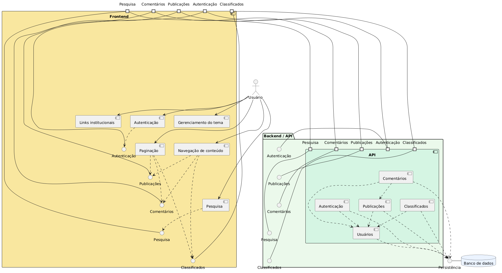
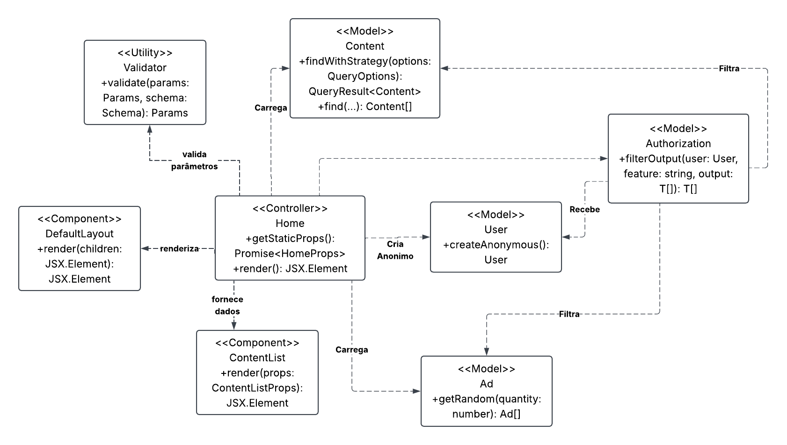
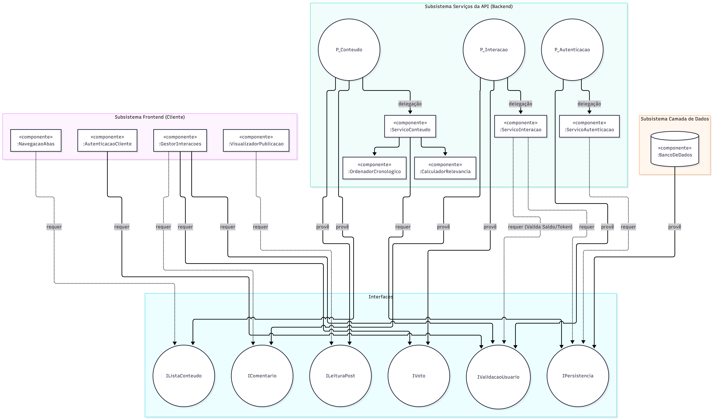

# SubEquipe_02 — Modelagem Estática na Notação UML

## Descrição

Modelagem do processo de negócio da SubEquipe_02, no escopo do **FOCO_01 — Modelagem Estática na Notação UML**. O documento apresenta a modelagem estática do software desenvolvido pela equipe, utilizando a notação UML para representar seus principais elementos estruturais e relacionamentos.

## Objetivo

Elaborar uma modelagem estática em UML para o sistema desenvolvido pela equipe, evidenciando seus principais elementos estruturais, relacionamentos e organização, de forma a facilitar a compreensão da estrutura do software.

## Metodologia

A modelagem estática foi elaborada a partir da análise do sistema e de suas principais funcionalidades, buscando identificar os elementos estruturais necessários para representar a solução.

O processo envolveu a identificação das principais entidades, classes, atributos, métodos e relacionamentos presentes no sistema, seguida da representação desses elementos utilizando a notação UML.

Para a elaboração do modelo, foram analisados os requisitos e as funcionalidades definidas para o projeto, relacionando-os aos elementos estruturais do software. A modelagem foi desenvolvida de forma colaborativa pelos integrantes da SubEquipe_02, utilizando as ferramentas adotadas pela equipe para elaboração e documentação dos modelos.

As decisões de modelagem foram fundamentadas nos conceitos da UML e na literatura de Engenharia de Software, buscando representar de maneira clara e consistente a estrutura do sistema.

## Conteúdo

### Modelagem Estática

### Diagrama de Pacotes do TabNews — Isaac Menezes

O modelo foi construído usando o site plantuml.com e sua linguagem descritiva padrão. 
Todos os componentes foram pensadas a partir dos seguintes objetos presentes no fórum:
- Aba Relevantes;
- Aba Recentes;
- Campo de pesquisa;
- Ícone de mudança de tema de cor;
- Função de login;
- Função de cadastro;
- Aba de publicações;
- Aba de comentários;
- Aba de classificados;
- Aba Todos;
- Lista de comentários;
- Botão para próxima página;
- Botão para página anterior;
- Botão de contato;
- Botão de FAQ;
- Botão com link do GitHub;
- Botões de FAQ, GitHub, Museu, RSS, Sobre, Termos de Uso e curso.dev.

De maneira evidente, esses objetos foram melhor ajustados, levando em consideração seus comportamentos e dependências no site, para gerar o seguinte Diagrama de Pacotes.

  
  
  
<strong>Figura 1:</strong> Diagrama de Pacotes. Fonte: SubEquipe_02 (2026).

O Diagrama mostra as relações dinâmicas que o usuário tem com diversos pacotes do fórum, detre eles, Frontend, Backend, Pesquisa, Banco de dados, etc.
O Diagrama foi feito na linguagem descritiva padrão do plantuml.com e o link para o script é este: https://drive.google.com/file/d/1vNdjDWz9vci6-VCckC8cAPcvgJLjPlSB/view?usp=sharing

### Diagrama de Classes - Pablo Rodrigues
Aqui temos uma visão geral de como o código foi estruturado, enfatizando a funcionalidade de seus componentes e como eles trabalham entre si.
As classes retratadas são:
- User
- Validator
- Authorization
- Content
- Ad

Modelo feito originalmente no Plantuml mas depois foi usado Lucidchart para utilizar a IA para correções e sugestões.

  
  
  
<strong>Figura 2:</strong> Diagrama de Classes. Fonte: SubEquipe_02 (2026).

### Diagrama de Componentes - Pedro Ramos

O diagrama de componentes foi elaborado com o objetivo de representar a organização estrutural do sistema TabNews, mostrando como os principais módulos se relacionam e como as responsabilidades são distribuídas entre o cliente, a interface, os serviços de aplicação e a base de dados. A partir da análise do modelo, é possível observar que o sistema é composto por diferentes subsistemas que se comunicam entre si, permitindo a navegação, o processamento de dados e a persistência das informações.

  
  
  
<strong>Figura 3:</strong> Diagrama de Componentes. Fonte: SubEquipe_02 (2026).

## Pontos de Vista dos Integrantes

### Isaac Menezes

O Diagrama de Pacotes da tela inicial possibilitou visualizar a divisão dos recursos em grupos organizados. Cada pacote representa uma parte específica da interface ou uma funcionalidade do sistema. Essa separação contribui para compreender melhor a estrutura interna da aplicação. Também foi possível observar como os pacotes dependem uns dos outros para executar suas funções. Assim, o diagrama auxilia na organização e na manutenção dos componentes relacionados à tela inicial.

### Pablo Rodrigues

O diagrama de classes possibilitou compreender com mais clareza como as funciolidades da tela inicial estão estruturadas em relação às suas classes. O processo de criação do diagrama também trouxe a tona funções que passariam despercebido normalmente, como a geração de anúncios e a autorização das postagens, também como cada função pode facilmente interagir em outras áreas do código por meio da importação de classes, sem a necessidade de criar isoladamente uma função para cada.

### Pedro Ramos

O diagrama de componentes ajudou bastante a entender a arquitetura do TabNews e como os módulos se conversam para entregar algo bem organizado para o usuário. Graças a ele, foi possível perceber que a aplicação não é só um monte de tela isolada, mas uma estrutura em que a interface, os serviços e o banco de dados interagem entre si.

## Referências

H. Washizaki, eds., Guide to the Software Engineering Body of Knowledge (SWEBOK Guide), Version 4.0, IEEE Computer Society, 2024. Acesso em 14 set. de 2026.

LUCID SOFTWARE INC. **Tutorial de diagrama de classes UML**. Disponível em: [https://app.lucid.co/pt/diagrama/uml/tutorial-de-diagrama-de-classes](https://app.lucid.co/pt/diagrama/uml/tutorial-de-diagrama-de-classes). Acesso em: 15 set. 2026.

OBJECT MANAGEMENT GROUP. **OMG Unified Modeling Language (OMG UML), Version 2.5.1**. 2017. Disponível em: [https://www.omg.org/spec/UML/2.5.1/PDF](https://www.omg.org/spec/UML/2.5.1/PDF). Acesso em: 15 set. 2026.

TABNEWS. **TabNews**. Disponível em: [https://www.tabnews.com.br](https://www.tabnews.com.br). Acesso em: 16 set. 2026.

UNB FCTE — ARQDSW. **Módulo de Modelagem**. Disponível em: [https://sites.google.com/view/unb-fcte-arqdsw/módulos/módulo-modelagem?authuser=0](https://sites.google.com/view/unb-fcte-arqdsw/módulos/módulo-modelagem?authuser=0). Acesso em: 15 set. 2026.

## Nível de Contribuição dos Integrantes

| Nome | % de Contribuição |
|------|-------------------|
|Isaac Menezes| 33,3% |
|Pablo Rodrigues|33,3%|
|Pedro Ramos|33,3%|

Tabela 1: Contribuição dos integrantes.

## Histórico de Versões

| Versão | Data | Descrição | Autor(es) | Revisor(es) | Detalhe da Revisão |
|:------:|:----:|:----------|:----------|:------------|:-------------------|
| 1.0 | 13/09/2026  | Criação do documento de Modelagem Estática na Notação UML da SubEquipe_02. | [Arthur Fernandes](https://github.com/arthurfernandesj) | [Pablo Rodrigues](https://github.com/Pablo-R-L) | Criação da estrutura inicial do documento e preparação para inserção da modelagem estática. |
| 1.1 | 17/09/2026  | Inserção de Diagrama de Pacotes. | [Isaac Menezes](https://github.com/pratamz250) |[Pablo Rodrigues](https://github.com/Pablo-R-L)| Inserção de Diagrama de Pacotes. |
| 1.2 | 17/09/2026  | Criação do diagrama de classes. | [Pablo Rodrigues](https://github.com/Pablo-R-L) | [Pedro Ramos](https://github.com/PedroRSR) | Criação do diagrama de classes com a ferramenta lucidchart e adição, junto à descrição do diagrama, no documento. |
| 1.3 | 17/09/2026  | Inserção do diagrama de componentes e revisão do conteúdo estrutural do documento. | [Pedro Ramos](https://github.com/PedroRSR) | [Isaac Menezes](https://github.com/pratamz250) | Inclusão do diagrama de componentes e ajustes na organização do texto da modelagem estática. |
| 1.4 | 17/09/2026  | Organização do tópico de pontos de vista. | [Pablo Rodrigues](https://github.com/Pablo-R-L) | [Pedro Ramos](https://github.com/PedroRSR) | Vericação da correção gramatical |
| 1.5 | 17/09/2026 | Adição do meu ponto de vista. | [Pedro Ramos](https://github.com/PedroRSR) | [Pablo Rodrigues](https://github.com/Pablo-R-L) | Vericação da correção gramatical |

Tabela 2: Histórico de Versões.

