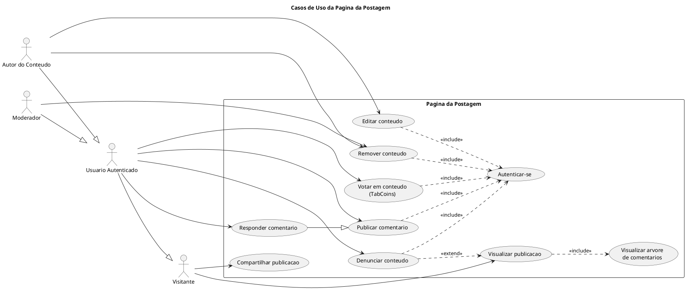
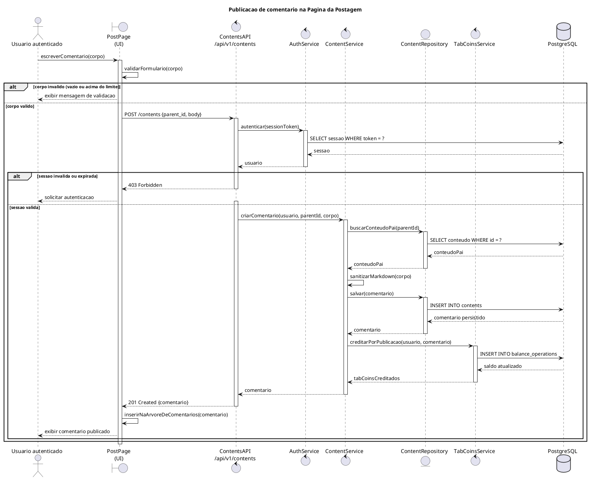
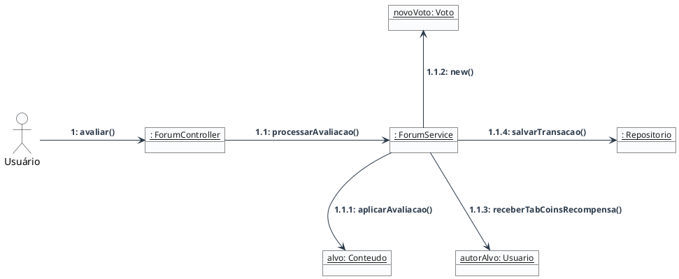
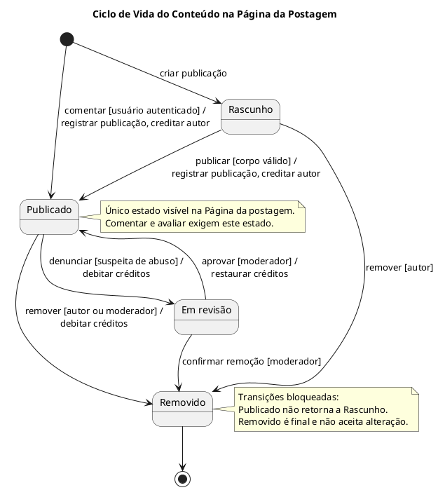

# SubEquipe_03 — Modelagem Dinâmica na Notação UML

## Descrição

Modelagem do processo de negócio da SubEquipe_03, no escopo do **FOCO_02 — Modelagem Dinâmica na Notação UML**. O documento apresenta a modelagem dinâmica do software utilizando a notação UML, buscando representar o comportamento do sistema e a interação entre seus principais elementos ao longo da execução dos processos.

## Objetivo

Elaborar uma modelagem dinâmica em UML para o sistema desenvolvido pela equipe, evidenciando o comportamento dos processos, as atividades realizadas, os eventos, as interações e os pontos de decisão envolvidos na execução das funcionalidades do sistema.

## Metodologia

A modelagem dinâmica foi elaborada a partir da análise dos processos e das funcionalidades do sistema, buscando representar o comportamento da aplicação e a sequência de eventos envolvidos em sua execução.

O processo envolveu a identificação dos principais fluxos e interações do sistema, considerando as ações realizadas pelos usuários e as respostas produzidas pela aplicação. A partir dessa análise, foram definidos os elementos necessários para representar o comportamento do processo utilizando a notação UML.

A elaboração do modelo foi realizada de forma colaborativa pelos integrantes da SubEquipe_03, utilizando as ferramentas adotadas pela equipe para construção e documentação dos diagramas.

As decisões de modelagem foram fundamentadas nos conceitos da UML e na literatura de Engenharia de Software, buscando representar de maneira clara e consistente o comportamento do sistema.

## Escolha da Modelagem

A estratégia adotada utiliza diagramas comportamentais complementares, de modo que cada um responda a uma pergunta distinta sobre a Página da postagem:

1. **Diagrama de Casos de Uso:** delimita a fronteira da funcionalidade, identificando os atores envolvidos e os serviços que a página oferece a cada um deles. Responde *"o que o sistema faz e para quem"*.
2. **Diagrama de Sequência:** detalha a ordem temporal das mensagens trocadas entre os objetos durante a execução de um fluxo específico. Responde *"em que ordem isso acontece"*.
3. **Diagrama de Comunicação:** apresenta a mesma interação sob ênfase estrutural, evidenciando os vínculos entre as instâncias que colaboram. Responde *"quem se conecta com quem"*.
4. **Diagrama de Estados:** descreve o ciclo de vida do conteúdo, identificando as situações em que ele pode estar, os eventos que provocam mudança e as transições impedidas. Responde *"por quais estados o conteúdo passa"*.

A escolha conjunta do Diagrama de Sequência e do Diagrama de Comunicação é deliberada. Ambos são diagramas de interação e, segundo a especificação da UML 2.5.1 (OMG, 2017), expressam informação semanticamente equivalente, diferindo apenas na ênfase: o de sequência destaca a ordenação temporal, enquanto o de comunicação destaca a organização estrutural dos participantes. Apresentá-los lado a lado permite discutir criticamente essa equivalência e demonstrar domínio da notação, em vez de multiplicar diagramas sem propósito.

O Diagrama de Casos de Uso foi posicionado como ponto de entrada por cumprir a função de delimitar o escopo antes do detalhamento dos fluxos, conforme a abordagem descrita por Booch, Rumbaugh e Jacobson (2005).

## Modelagem Dinâmica

### 1. Diagrama de Casos de Uso

O Diagrama de Casos de Uso delimita a fronteira da **Página da postagem** e identifica os quatro atores que interagem com ela. O ator `Visitante` representa o usuário não autenticado, que dispõe apenas das operações de leitura e compartilhamento. O `Usuário Autenticado` o especializa, acrescentando as operações de escrita e de avaliação. Dele derivam ainda o `Autor do Conteúdo`, responsável pela edição e remoção do próprio conteúdo, e o `Moderador`, que pode remover conteúdo de terceiros.

Os relacionamentos `«include»` evidenciam que autenticar-se é condição obrigatória para todas as operações de escrita, ao passo que o relacionamento `«extend»` registra que denunciar um conteúdo é um comportamento opcional, acionado a partir da visualização da publicação. A generalização entre *Responder comentário* e *Publicar comentário* reflete a estrutura recursiva da árvore de comentários já representada no Diagrama de Classes: responder é publicar um comentário cujo conteúdo-pai é outro comentário.

Figura 1: Diagrama de Casos de Uso da Página da postagem. Fonte: SubEquipe_03 (2026).

### 2. Diagrama de Sequência

O Diagrama de Sequência detalha o fluxo de **publicação de um comentário**, desde a submissão do formulário até a atualização da árvore de comentários na interface. Foi escolhido por concentrar, em um único fluxo, os três elementos centrais da funcionalidade: a validação da entrada, o controle de acesso e a regra de negócio dos TabCoins.

O diagrama emprega dois fragmentos combinados do tipo `alt`. O primeiro separa a validação realizada no cliente, que evita uma requisição desnecessária quando o corpo do comentário é inválido. O segundo trata a verificação de sessão no servidor, retornando `403 Forbidden` quando a sessão é inválida ou expirada — o que caracteriza a validação em duas camadas adotada pela aplicação.

Observa-se ainda que a criação do comentário dispara o crédito de TabCoins ao autor, registrado como uma operação de saldo distinta da persistência do conteúdo. Essa separação é o que permite auditar o histórico de movimentações independentemente do conteúdo que as originou.

Figura 2: Diagrama de Sequência — publicação de comentário. Fonte: SubEquipe_03 (2026).

### 3. Diagrama de Comunicação

O Diagrama de Comunicação representa o fluxo de avaliação de um conteúdo (votação em TabCoins). Focado na visão estrutural da interação, este diagrama  abdica da linha do tempo vertical para destacar a topologia da rede de objetos e nos vínculos (links) por onde as mensagens trafegam.

A modelagem ilustra a requisição iniciada pelo usuário autenticado através da interface, que se comunica com o controlador da API. A partir desse ponto central, o diagrama evidencia o roteamento das mensagens sequenciadas (numeradas) entre os serviços do sistema. Observa-se a comunicação com o serviço de autenticação para validar o usuário antes que a ação seja processada, refletindo a segurança da rota.

Destaca-se, na colaboração estrutural, a necessidade de orquestrar diferentes domínios da aplicação para concluir um voto. O diagrama mapeia as conexões que permitem à API não apenas atualizar a pontuação do conteúdo votado, mas também interagir com o serviço financeiro/gamificado para creditar ou debitar o saldo de TabCoins do usuário, garantindo a consistência transacional da operação.

### 4. Diagrama de Estados

O Diagrama de Estados representa o ciclo de vida de um conteúdo do Fórum — tanto a publicação quanto o comentário, que compartilham a mesma máquina de estados por derivarem da abstração `Conteudo`. Enquanto os três diagramas anteriores são de interação e descrevem trocas de mensagens entre participantes, este descreve a evolução interna de um único objeto ao longo do tempo. É o diagrama que responde por quais situações o conteúdo passa entre ser criado e deixar de existir para os leitores.

Quatro estados compõem o ciclo. **Rascunho** é o ponto de partida da publicação em elaboração, ainda invisível para os demais usuários. **Publicado** é o estado em que o conteúdo integra a Página da postagem e passa a aceitar comentários e avaliações. **Em revisão** acolhe o conteúdo retirado de circulação por suspeita de abuso, à espera de decisão da moderação. **Removido** é o estado final: uma vez alcançado, nenhuma alteração é aceita.

Duas transições partem do estado inicial, e a distinção é deliberada. A publicação nasce em Rascunho e depende de uma ação explícita de publicar; o comentário nasce já em Publicado, porque não há etapa de elaboração privada ao responder na árvore. As ações associadas registram a data de publicação e creditam o autor, e o caminho inverso — sair de Publicado por remoção ou revisão — debita o crédito concedido, o que mantém o saldo coerente com o que está efetivamente visível. A saída de Em revisão tem apenas dois destinos: a moderação aprova o conteúdo, que retorna a Publicado com os créditos restaurados, ou confirma a remoção, levando-o a Removido.

As duas notas registram restrições que não se leem nas transições. A primeira identifica Publicado como único estado visível na Página da postagem, o que explica por que um comentário retirado do ar deixa de exibir conteúdo mas preserva o encadeamento da árvore quando possui respostas publicadas. A segunda registra as transições bloqueadas: um conteúdo publicado não regride a rascunho, e um conteúdo removido não admite alteração posterior.

**Base da análise.** O ciclo de vida foi levantado por leitura do código do TabNews, tomado como referência. Os quatro estados correspondem aos quatro valores aceitos para o campo de situação do conteúdo (`models/validator.js:265`), e o padrão de criação em rascunho está em `models/content.js:396`. As duas transições bloqueadas registradas na nota são verificações explícitas, com mensagem de erro própria: a volta de publicado para rascunho em `models/content.js:883` e a alteração de conteúdo já removido em `models/content.js:871`. O crédito ao autor na publicação está em `models/content.js:466-479` e `:530-537`, o débito ao deixar o estado publicado em `:502-527`, e a restauração dos créditos na aprovação da moderação em `models/firewall/review.js:187-193`. A restrição de que a revisão só desemboca em publicado ou removido — nunca de volta em rascunho — vem de `models/content.js:799-807`. A visibilidade restrita ao estado publicado aparece no filtro da consulta da árvore (`models/content.js:922` e `:962`) e na pré-geração da página (`pages/[username]/[slug]/index.jsx:276`); o comportamento de lápide descrito na primeira nota resulta da reconstrução dos ancestrais ausentes em `models/content.js:989-1022`, combinada com a regra de renderização em `pages/[username]/[slug]/index.jsx:216` e `:243`.

**Adaptações e omissões.** Os nomes dos estados foram traduzidos e despidos de termo técnico ou de marca — o estado de revisão, por exemplo, é chamado de `firewall` no sistema de referência. A entrada em revisão é modelada como o evento de denúncia previsto no Diagrama de Casos de Uso, e não como o mecanismo automático de bloqueio por endereço de origem em janela de dez minutos (`infra/migrations/1715808011643_create-firewall-side-effect-functions.js:71`), por ser este um detalhe de implementação. Ficaram deliberadamente fora do modelo: a transição de rascunho para revisão, que existe no sistema de referência mas é assimétrica, já que a restauração nunca devolve o conteúdo a rascunho; a distinção entre remoção pelo autor e pela moderação, que compartilham o mesmo estado final e se diferenciam apenas pela guarda; os estados do usuário, que pertencem a outra entidade; a separação entre conteúdo e anúncio, sem correspondente no Fórum; e a pontuação de relevância, que é valor derivado e contínuo, não estado discreto.

**Consistência com os demais diagramas.** O estado Publicado é a pré-condição implícita dos dois diagramas de interação do documento. No Diagrama de Sequência, o fluxo de publicação de comentário encerra com o crédito ao autor e a inserção na árvore — exatamente a transição para Publicado representada aqui, com a mesma ação de creditar. No Diagrama de Comunicação, a avaliação de um conteúdo só faz sentido sobre um conteúdo visível, isto é, em Publicado. No Diagrama de Classes, porém, a classe `Conteudo` expressa o ciclo de vida por meio do atributo booleano `ativo`, que distingue apenas duas situações. Representar os quatro estados aqui modelados exigiria substituí-lo por um atributo de status associado a uma enumeração, na linha do que já é feito com `TipoVoto`. A divergência fica registrada para alinhamento da equipe.

Figura 4: Diagrama de Estados — ciclo de vida do conteúdo. Fonte: SubEquipe_03 (2026).

## Referências

BOOCH, Grady; RUMBAUGH, James; JACOBSON, Ivar. **UML: Guia do Usuário**. 2. ed. Rio de Janeiro: Elsevier, 2005.

FOWLER, Martin. **UML Essencial: um breve guia para a linguagem-padrão de modelagem de objetos**. 3. ed. Porto Alegre: Bookman, 2005.

OBJECT MANAGEMENT GROUP. **OMG Unified Modeling Language (OMG UML), Version 2.5.1**. 2017. Disponível em: [https://www.omg.org/spec/UML/2.5.1/PDF](https://www.omg.org/spec/UML/2.5.1/PDF). Acesso em: 17 set. 2026.

SERRANO, Milene. **Modelagem UML Dinâmica**. Notas de aula da disciplina Arquitetura e Desenho de Software (FGA0208). Brasília: Universidade de Brasília, 2026.

UML-DIAGRAMS.ORG. **UML Sequence Diagrams**. Disponível em: [https://www.uml-diagrams.org/sequence-diagrams.html](https://www.uml-diagrams.org/sequence-diagrams.html). Acesso em: 17 set. 2026.

UML-DIAGRAMS.ORG. **UML State Machine Diagrams**. Disponível em: [https://www.uml-diagrams.org/state-machine-diagrams.html](https://www.uml-diagrams.org/state-machine-diagrams.html). Acesso em: 17 set. 2026.

UML-DIAGRAMS.ORG. **UML Use Case Diagrams**. Disponível em: [https://www.uml-diagrams.org/use-case-diagrams.html](https://www.uml-diagrams.org/use-case-diagrams.html). Acesso em: 17 set. 2026.

## Nível de Contribuição dos Integrantes

| Nome | % de Contribuição |
|:---|:---:|
| [Caio Alexandre](https://github.com/bitterteriyaki) | 30% |
| [Guilherme Moura](https://github.com/Guilherme-Moura) | 30% |
| [Leonardo Fachinello Bonetti](https://github.com/LeoFacB) | |

Tabela 1: Contribuição dos integrantes.

## Histórico de Versões

| Versão | Data | Descrição | Autor(es) | Revisor(es) | Detalhe da Revisão |
|:------:|:----:|:----------|:----------|:------------|:-------------------|
| 1.0 | 13/09/2026 | Criação do documento de Modelagem Dinâmica na Notação UML da SubEquipe_03. | [Arthur Fernandes](https://github.com/arthurfernandesj)  |  | Criação da estrutura inicial do documento e preparação para inserção da modelagem dinâmica. |
| 1.1 | 17/09/2026 | Adição do Diagrama de Casos de Uso e do Diagrama de Sequência da Página da postagem. | [Caio Alexandre](https://github.com/bitterteriyaki) | [Arthur Fernandes](https://github.com/arthurfernandesj) | Elaboração dos dois diagramas em PlantUML, definição da seção Escolha da Modelagem com a justificativa da complementaridade entre os diagramas de interação e inclusão das referências bibliográficas. |
| 1.2 | 17/09/2026 | Adição do Diagrama de Estados do conteúdo da Página da postagem. | [Leonardo Fachinello Bonetti](https://github.com/LeoFacB) | [Arthur Fernandes](https://github.com/arthurfernandesj) | Elaboração do Diagrama de Estados em PlantUML, com os estados Rascunho, Publicado, Em revisão e Removido, transições no formato evento/guarda/ação, notas das transições bloqueadas e do estado que torna o conteúdo visível, além da rastreabilidade das decisões no texto da seção, do item 4 na Escolha da Modelagem e das referências correspondentes. |
| 1.3 | 17/09/2026 | Adição do Diagrama de Comunicação para o fluxo de avaliação de conteúdo. | [Guilherme Moura](https://github.com/Guilherme-Moura) | [Leonardo Fachinello Bonetti](https://github.com/LeoFacB) | Inserção do artefato visual correspondente à modelagem do fluxo de votação em TabCoins.
| 1.4 | 17/09/2026 | Correção da lista de integrantes e atualização das contribuições. | [Guilherme Moura](https://github.com/Guilherme-Moura) | [Leonardo Fachinello Bonetti](https://github.com/LeoFacB) | Correção dos nomes dos membros da SubEquipe_03 e preenchimento da porcentagem de contribuição individual na tabela correspondente. |

Tabela 2: Histórico de Versões.

Ver também: [Modelagem Estática na Notação UML](ModelagemEstatica.md) · [IA Generativa](IAGenerativa.md)