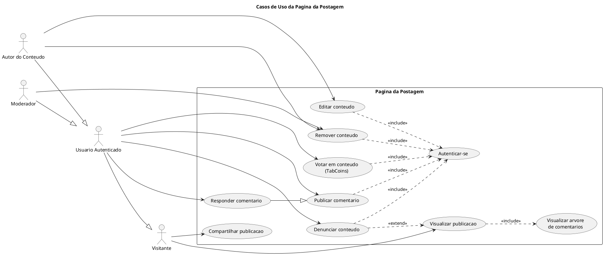
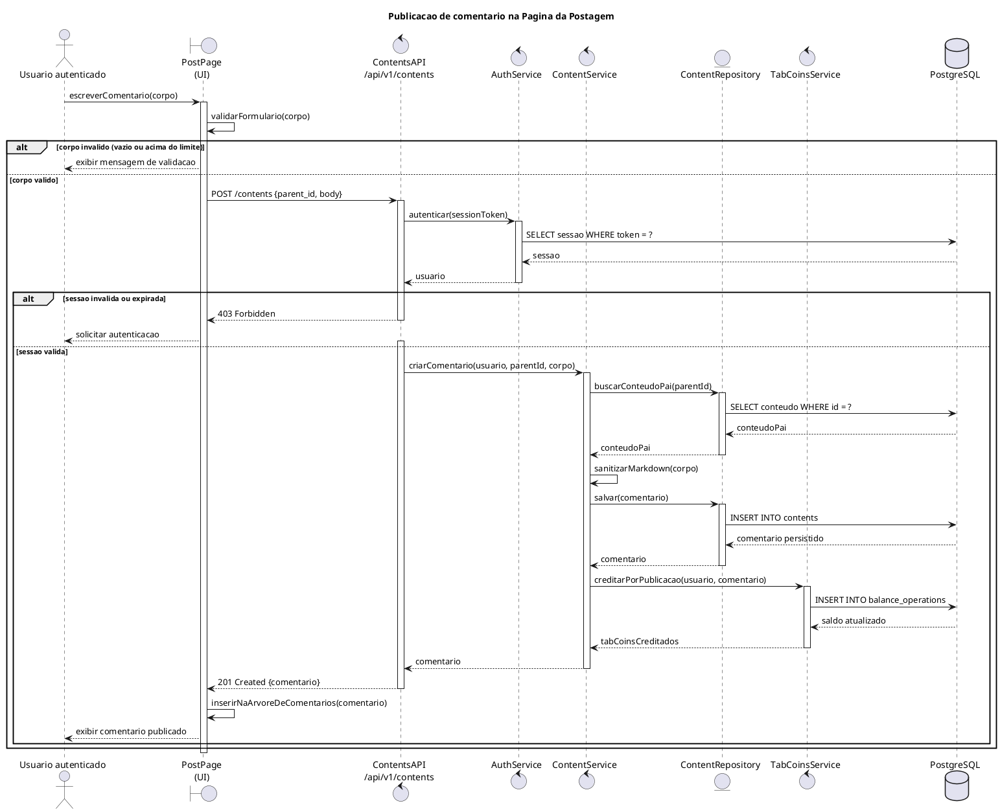
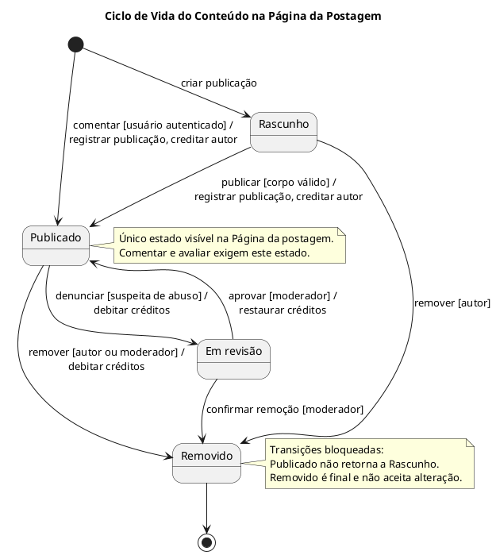

# SubEquipe_03 — Modelagem Dinâmica na Notação UML

## Descrição

Modelagem do processo de negócio da SubEquipe_03, no escopo do **FOCO_02 — Modelagem Dinâmica na Notação UML**. O documento apresenta a modelagem dinâmica do software utilizando a notação UML, buscando representar o comportamento do sistema e a interação entre seus principais elementos ao longo da execução dos processos.

## Objetivo

Elaborar uma modelagem dinâmica em UML para o sistema desenvolvido pela equipe, evidenciando o comportamento dos processos, as atividades realizadas, os eventos, as interações e os pontos de decisão envolvidos na execução das funcionalidades do sistema.

## Metodologia

A modelagem dinâmica foi elaborada a partir da análise dos processos e das funcionalidades do sistema, buscando representar o comportamento da aplicação e a sequência de eventos envolvidos em sua execução.

O processo envolveu a identificação dos principais fluxos e interações do sistema, considerando as ações realizadas pelos usuários e as respostas produzidas pela aplicação. A partir dessa análise, foram definidos os elementos necessários para representar o comportamento do processo utilizando a notação UML.

A elaboração do modelo foi realizada de forma colaborativa pelos integrantes da SubEquipe_03, utilizando as ferramentas adotadas pela equipe para construção e documentação dos diagramas.

As decisões de modelagem foram fundamentadas nos conceitos da UML e na literatura de Engenharia de Software, buscando representar de maneira clara e consistente o comportamento do sistema.

## Escolha da Modelagem

A estratégia adotada utiliza diagramas comportamentais complementares, de modo que cada um responda a uma pergunta distinta sobre a Página da postagem:

1. **Diagrama de Casos de Uso:** delimita a fronteira da funcionalidade, identificando os atores envolvidos e os serviços que a página oferece a cada um deles. Responde *"o que o sistema faz e para quem"*.
2. **Diagrama de Sequência:** detalha a ordem temporal das mensagens trocadas entre os objetos durante a execução de um fluxo específico. Responde *"em que ordem isso acontece"*.
3. **Diagrama de Comunicação:** apresenta a mesma interação sob ênfase estrutural, evidenciando os vínculos entre as instâncias que colaboram. Responde *"quem se conecta com quem"*.

A escolha conjunta do Diagrama de Sequência e do Diagrama de Comunicação é deliberada. Ambos são diagramas de interação e, segundo a especificação da UML 2.5.1 (OMG, 2017), expressam informação semanticamente equivalente, diferindo apenas na ênfase: o de sequência destaca a ordenação temporal, enquanto o de comunicação destaca a organização estrutural dos participantes. Apresentá-los lado a lado permite discutir criticamente essa equivalência e demonstrar domínio da notação, em vez de multiplicar diagramas sem propósito.

O Diagrama de Casos de Uso foi posicionado como ponto de entrada por cumprir a função de delimitar o escopo antes do detalhamento dos fluxos, conforme a abordagem descrita por Booch, Rumbaugh e Jacobson (2005).

## Modelagem Dinâmica

### 1. Diagrama de Casos de Uso

O Diagrama de Casos de Uso delimita a fronteira da **Página da postagem** e identifica os quatro atores que interagem com ela. O ator `Visitante` representa o usuário não autenticado, que dispõe apenas das operações de leitura e compartilhamento. O `Usuário Autenticado` o especializa, acrescentando as operações de escrita e de avaliação. Dele derivam ainda o `Autor do Conteúdo`, responsável pela edição e remoção do próprio conteúdo, e o `Moderador`, que pode remover conteúdo de terceiros.

Os relacionamentos `«include»` evidenciam que autenticar-se é condição obrigatória para todas as operações de escrita, ao passo que o relacionamento `«extend»` registra que denunciar um conteúdo é um comportamento opcional, acionado a partir da visualização da publicação. A generalização entre *Responder comentário* e *Publicar comentário* reflete a estrutura recursiva da árvore de comentários já representada no Diagrama de Classes: responder é publicar um comentário cujo conteúdo-pai é outro comentário.

Figura 1: Diagrama de Casos de Uso da Página da postagem. Fonte: SubEquipe_03 (2026).

### 2. Diagrama de Sequência

O Diagrama de Sequência detalha o fluxo de **publicação de um comentário**, desde a submissão do formulário até a atualização da árvore de comentários na interface. Foi escolhido por concentrar, em um único fluxo, os três elementos centrais da funcionalidade: a validação da entrada, o controle de acesso e a regra de negócio dos TabCoins.

O diagrama emprega dois fragmentos combinados do tipo `alt`. O primeiro separa a validação realizada no cliente, que evita uma requisição desnecessária quando o corpo do comentário é inválido. O segundo trata a verificação de sessão no servidor, retornando `403 Forbidden` quando a sessão é inválida ou expirada — o que caracteriza a validação em duas camadas adotada pela aplicação.

Observa-se ainda que a criação do comentário dispara o crédito de TabCoins ao autor, registrado como uma operação de saldo distinta da persistência do conteúdo. Essa separação é o que permite auditar o histórico de movimentações independentemente do conteúdo que as originou.

Figura 2: Diagrama de Sequência — publicação de comentário. Fonte: SubEquipe_03 (2026).

### 3. Diagrama de Comunicação

O Diagrama de Comunicação representa o fluxo de avaliação de um conteúdo (votação em TabCoins), evidenciando a colaboração e a troca de mensagens entre os objetos participantes.

<!-- ESPAÇO RESERVADO PARA O DIAGRAMA DE COMUNICAÇÃO
     Artefato elaborado na branch `docs/sub03-dinamico`.
     Ao integrar a branch, substituir este comentário por:

Figura 3: Diagrama de Comunicação — avaliação de conteúdo. Fonte: SubEquipe_03 (2026).

-->

### 4. Diagrama de Estados

Figura 4: Diagrama de Estados — ciclo de vida do conteúdo. Fonte: SubEquipe_03 (2026).

## Referências

BOOCH, Grady; RUMBAUGH, James; JACOBSON, Ivar. **UML: Guia do Usuário**. 2. ed. Rio de Janeiro: Elsevier, 2005.

FOWLER, Martin. **UML Essencial: um breve guia para a linguagem-padrão de modelagem de objetos**. 3. ed. Porto Alegre: Bookman, 2005.

OBJECT MANAGEMENT GROUP. **OMG Unified Modeling Language (OMG UML), Version 2.5.1**. 2017. Disponível em: [https://www.omg.org/spec/UML/2.5.1/PDF](https://www.omg.org/spec/UML/2.5.1/PDF). Acesso em: 17 set. 2026.

UML-DIAGRAMS.ORG. **UML Sequence Diagrams**. Disponível em: [https://www.uml-diagrams.org/sequence-diagrams.html](https://www.uml-diagrams.org/sequence-diagrams.html). Acesso em: 17 set. 2026.

UML-DIAGRAMS.ORG. **UML Use Case Diagrams**. Disponível em: [https://www.uml-diagrams.org/use-case-diagrams.html](https://www.uml-diagrams.org/use-case-diagrams.html). Acesso em: 17 set. 2026.

## Nível de Contribuição dos Integrantes

| Nome | % de Contribuição |
|:---|:---:|
| [Caio Alexandre](https://github.com/bitterteriyaki) | 30% |
| [Guilherme Moura](https://github.com/Guilherme-Moura) | |
| [Leonardo Fachinello Bonetti](https://github.com/LeoFacB) | |
| [Pablo Rodrigues Lima](https://github.com/Pablo-R-L) | |

Tabela 1: Contribuição dos integrantes.

## Histórico de Versões

| Versão | Data | Descrição | Autor(es) | Revisor(es) | Detalhe da Revisão |
|:------:|:----:|:----------|:----------|:------------|:-------------------|
| 1.0 | 13/09/2026 | Criação do documento de Modelagem Dinâmica na Notação UML da SubEquipe_03. | [Arthur Fernandes](https://github.com/arthurfernandesj)  |  | Criação da estrutura inicial do documento e preparação para inserção da modelagem dinâmica. |
| 1.1 | 17/09/2026 | Adição do Diagrama de Casos de Uso e do Diagrama de Sequência da Página da postagem. | [Caio Alexandre](https://github.com/bitterteriyaki) | [Arthur Fernandes](https://github.com/arthurfernandesj) | Elaboração dos dois diagramas em PlantUML, definição da seção Escolha da Modelagem com a justificativa da complementaridade entre os diagramas de interação e inclusão das referências bibliográficas. |

Tabela 2: Histórico de Versões.

Ver também: [Modelagem Estática na Notação UML](ModelagemEstatica.md) · [IA Generativa](IAGenerativa.md)