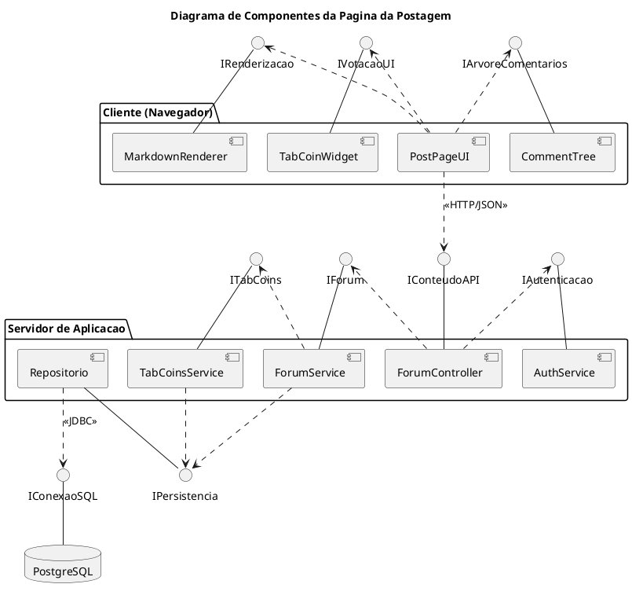
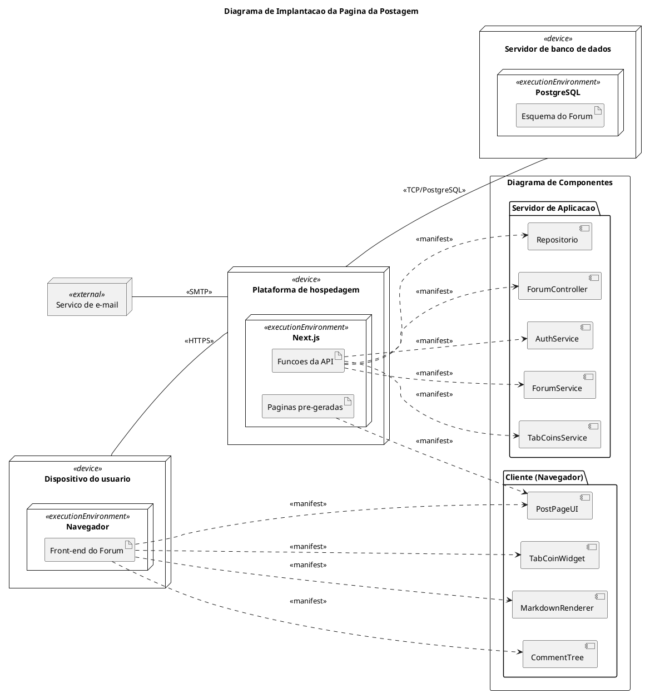

# SubEquipe_03 — Modelagem Estática na Notação UML

## Descrição

Modelagem estática da funcionalidade **Página da postagem** do TabNews, no escopo do **FOCO_01 — Modelagem Estática na Notação UML**. O documento representa a estrutura da publicação expandida, incluindo seu conteúdo, a árvore de comentários e a votação em TabCoins, utilizando três tipos diferentes de diagramas estáticos para oferecer visões arquiteturais complementares.

## Objetivo

Representar as principais classes, atributos, métodos e relacionamentos envolvidos na Página da postagem, mantendo o nível de abstração adequado à funcionalidade analisada.

## Metodologia

A modelagem estática foi elaborada a partir da análise da estrutura da funcionalidade Página da postagem no sistema TabNews, buscando representar os elementos que compõem a aplicação e os relacionamentos existentes entre eles.

O processo envolveu a identificação das entidades de domínio, de seus atributos e responsabilidades e das unidades de software que as realizam. Em vez de utilizar recortes de um único diagrama, a equipe optou por desenvolver tipos distintos de diagramas estáticos, todos com escopo na página completa, de modo a obter visões complementares em diferentes níveis de abstração.

A elaboração do modelo foi realizada de forma colaborativa pelos integrantes da SubEquipe_03, utilizando as ferramentas adotadas pela equipe para construção e documentação dos diagramas.

As decisões de modelagem foram fundamentadas nos conceitos da UML e na literatura de Engenharia de Software, buscando representar de maneira clara e consistente a estrutura do sistema.

## Escolha da Modelagem

A estratégia adotada utiliza diagramas estruturais complementares, de modo que cada um responda a uma pergunta distinta sobre a Página da postagem:

1. **Diagrama de Classes:** representa a estrutura lógica do domínio, com os atributos, as operações e os relacionamentos entre publicação, comentários, votos e usuários. Responde *"de que o sistema é feito"*.
2. **Diagrama de Componentes:** representa a organização modular da aplicação, detalhando as unidades de software que compõem a página e os contratos estabelecidos entre elas. Responde *"como as partes se encaixam"*.
3. **Diagrama de Implantação:** representa a distribuição física da aplicação, indicando em quais nós os artefatos são implantados e quais componentes cada artefato manifesta. Responde *"onde o sistema é executado"*.

A escolha conjunta do Diagrama de Classes e do Diagrama de Componentes é deliberada. Ambos são diagramas estruturais, mas operam em níveis de abstração distintos: segundo a especificação da UML 2.5.1 (OMG, 2017), o de classes descreve os classificadores do domínio, enquanto o de componentes descreve unidades substituíveis que encapsulam sua realização e se relacionam por interfaces providas e requeridas. Apresentá-los lado a lado permite discutir a passagem do modelo conceitual para a organização arquitetural, em vez de repetir a mesma informação em duas notações.

O Diagrama de Implantação encerra essa progressão ao situar a aplicação no ambiente de execução. A continuidade entre os três modelos é explícita: os componentes definidos no Diagrama de Componentes são os mesmos manifestados pelos artefatos no Diagrama de Implantação, de modo que é possível percorrer o caminho que vai de uma classe de domínio até o nó em que ela efetivamente executa.

O Diagrama de Classes foi posicionado como ponto de entrada por estabelecer o vocabulário de domínio reutilizado pelos demais modelos, conforme a abordagem descrita por Booch, Rumbaugh e Jacobson (2005).

## Modelagem Estática

### 1. Diagrama de Classes

O Diagrama de Classes representa a estrutura lógica e de domínio de toda a Página da postagem, detalhando os atributos, métodos e os relacionamentos hierárquicos necessários para exibir a publicação e sua árvore de comentários.

Figura 1: Diagrama de Classes completo da Página da postagem. Fonte: SubEquipe_03 (2026).

### 2. Diagrama de Componentes

Este diagrama oferece uma visão modular e de subsistemas da Página da postagem completa, ilustrando como as partes da aplicação se organizam e se conectam para fornecer a funcionalidade aos usuários. Enquanto o Diagrama de Classes representa o domínio em termos lógicos, o Diagrama de Componentes eleva o nível de abstração para os artefatos de software e para os contratos estabelecidos entre eles.

A organização adotada distribui os componentes em três camadas. O **Cliente (Navegador)** reúne os elementos de interface: `PostPageUI` atua como componente agregador e consome os serviços de `CommentTree`, responsável pela renderização recursiva da árvore de comentários, `TabCoinWidget`, responsável pela interação de votação, e `MarkdownRenderer`, responsável pela conversão do corpo do conteúdo. O **Servidor de Aplicação** concentra `ForumController`, `AuthService`, `ForumService`, `TabCoinsService` e `Repositorio`, mantendo a mesma nomenclatura empregada no Diagrama de Classes para preservar a rastreabilidade entre os dois modelos. A persistência é representada pelo nó `PostgreSQL`.

As dependências são expressas pela notação de interfaces providas e requeridas (*ball-and-socket*). Essa escolha é deliberada: ela evidencia que os componentes não se acoplam entre si diretamente, mas por meio de contratos explícitos. `ForumController` requer `IAutenticacao` e `IForum` sem conhecer as implementações de `AuthService` e `ForumService`, e tanto `ForumService` quanto `TabCoinsService` requerem a mesma interface `IPersistencia`, provida por `Repositorio` — o que concentra o acesso a dados em um único ponto do sistema.

Dois relacionamentos recebem estereótipos por atravessarem fronteiras de execução: `«HTTP/JSON»`, entre o cliente e o servidor, e `«JDBC»`, entre o repositório e o banco. Esses são os pontos em que a comunicação deixa de ser uma chamada em memória e passa a depender de rede, o que os torna relevantes para discussões de desempenho e de tratamento de falhas.

Figura 2: Diagrama de Componentes da Página da postagem. Fonte: SubEquipe_03 (2026).

### 3. Diagrama de Implantação

O Diagrama de Implantação apresenta a distribuição física da funcionalidade Página da
Postagem, mostrando em quais nós os artefatos do Fórum são implantados e quais
componentes cada artefato manifesta.

O Dispositivo do usuário hospeda o ambiente de execução Navegador, onde é implantado o
artefato Front-end do Fórum. Esse artefato manifesta os componentes da camada cliente:
PostPageUI, CommentTree, MarkdownRenderer e TabCoinWidget. A comunicação com o servidor
ocorre por HTTPS.

A Plataforma de hospedagem executa a aplicação web e concentra dois artefatos. As Páginas
pré-geradas correspondem à renderização antecipada da página da publicação, entregue já
montada ao navegador e revalidada periodicamente. As Funções da API atendem às ações do
usuário e manifestam os componentes do servidor: ForumController, ForumService,
AuthService, TabCoinsService e Repositorio.

O Servidor de banco de dados executa o PostgreSQL e recebe o artefato Esquema do Fórum,
com as tabelas de conteúdos, usuários e avaliações. O acesso ocorre por conexão TCP a
partir da plataforma de hospedagem. O Serviço de e-mail é um nó externo, acionado apenas
para notificar o autor de um conteúdo quando ele recebe uma resposta.

A separação entre páginas pré-geradas e funções de API explica uma característica central
da funcionalidade: a leitura da publicação e da árvore de comentários não depende de
requisições adicionais após o carregamento, enquanto responder e avaliar exigem chamadas
autenticadas ao servidor. Essa distinção é a contrapartida física das interfaces
representadas no Diagrama de Componentes.

Figura 3: Diagrama de Implantação da Página da postagem. Fonte: SubEquipe_03 (2026).

## Referências

BOOCH, Grady; RUMBAUGH, James; JACOBSON, Ivar. **UML: Guia do Usuário**. 2. ed. Rio de Janeiro: Elsevier, 2005.

OBJECT MANAGEMENT GROUP. **OMG Unified Modeling Language (OMG UML), Version 2.5.1**. 2017. Disponível em: [https://www.omg.org/spec/UML/2.5.1/PDF](https://www.omg.org/spec/UML/2.5.1/PDF). Acesso em: 16 set. 2026.

PRESSMAN, Roger S.; MAXIM, Bruce R. **Engenharia de Software: uma abordagem profissional**. 8. ed. Porto Alegre: AMGH, 2016.

UML-DIAGRAMS.ORG. **UML Class Diagrams**. Disponível em: [https://www.uml-diagrams.org/class-diagrams/class-diagram.html](https://www.uml-diagrams.org/class-diagrams/class-diagram.html). Acesso em: 16 set. 2026.

UML-DIAGRAMS.ORG. **UML Component Diagrams**. Disponível em: [https://www.uml-diagrams.org/component-diagrams.html](https://www.uml-diagrams.org/component-diagrams.html). Acesso em: 17 set. 2026.

## Nível de Contribuição dos Integrantes

| Nome | % de Contribuição |
|:---|:---:|
| [Caio Alexandre](https://github.com/bitterteriyaki) | 30% |
| [Guilherme Moura](https://github.com/Guilherme-Moura) | 30% |
| [Leonardo Fachinello Bonetti](https://github.com/LeoFacB) | |

Tabela 1: Contribuição dos integrantes.

## Histórico de Versões

| Versão | Data | Descrição | Autor(es) | Revisor(es) | Detalhe da Revisão |
|:------:|:----:|:----------|:----------|:------------|:-------------------|
| 1.0 | 13/09/2026 | Criação do documento de Modelagem Estática na Notação UML da SubEquipe_03. | [Arthur Fernandes](https://github.com/arthurfernandesj) |  | Criação da estrutura inicial do documento e preparação para inserção da modelagem estática. |
| 1.1 | 17/09/2026 | Estruturação do documento de Modelagem Estática para a funcionalidade Página da postagem. | [Leonardo Fachinello Bonetti](https://github.com/LeoFacB) | [Guilherme Moura](https://github.com/Guilherme-Moura) | Definição do escopo na Página da postagem, da metodologia e da justificativa do Diagrama de Classes, e organização das seções do Diagrama de Classes completo, do recorte da Árvore de Comentários e do recorte de Votação / TabCoins. |
| 1.2 | 17/09/2026 | Alteração da estrutura do documento e adição do Diagrama de Classes. | [Guilherme Moura](https://github.com/Guilherme-Moura) | | Atualização das seções de Metodologia e Escolha da Modelagem para refletir o uso de três modelos estáticos complementares, além da inserção do artefato visual do Diagrama de Classes. |
| 1.3 | 17/09/2026 | Adição do Diagrama de Componentes da Página da postagem. | [Caio Alexandre](https://github.com/bitterteriyaki) | [Arthur Fernandes](https://github.com/arthurfernandesj) | Elaboração do Diagrama de Componentes em PlantUML, com organização em três camadas, notação de interfaces providas e requeridas, estereótipos nas fronteiras de execução e inclusão das referências correspondentes. |
| 1.4 | 17/09/2026 | Adição do Diagrama de Implantação da Página da postagem. | [Leonardo Fachinello Bonetti](https://github.com/LeoFacB) |  | Elaboração do Diagrama de Implantação em PlantUML, com os nós de dispositivo, hospedagem, banco de dados e serviço externo de e-mail, os artefatos implantados em cada ambiente de execução, os caminhos de comunicação com os protocolos HTTPS, TCP/PostgreSQL e SMTP, e as relações de manifestação que ligam cada artefato aos componentes do Diagrama de Componentes. |
| 1.5 | 17/09/2026 | Padronização das seções de Metodologia e Escolha da Modelagem. | [Caio Alexandre](https://github.com/bitterteriyaki) | [Leonardo Fachinello Bonetti](https://github.com/LeoFacB) | Alinhamento das duas seções ao modelo adotado no documento de Modelagem Dinâmica, com a justificativa da complementaridade entre os diagramas estruturais fundamentada na UML 2.5.1 e em Booch, Rumbaugh e Jacobson (2005), e inclusão da referência correspondente. |
| 1.7 | 17/09/2026 | Correção da lista de integrantes e atualização das contribuições. | [Guilherme Moura](https://github.com/Guilherme-Moura) | | Correção dos nomes dos membros da SubEquipe_03 e preenchimento da porcentagem de contribuição individual na tabela correspondente. |

Tabela 2: Histórico de Versões.

Ver também: [Modelagem Dinâmica na Notação UML](ModelagemDinamica.md) · [IA Generativa](IAGenerativa.md)